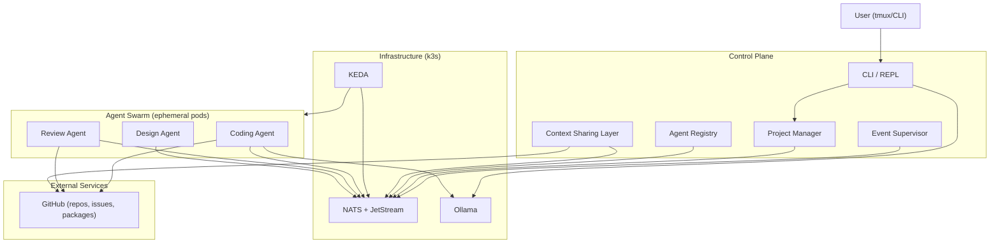

# AI Coding Agent Orchestrator

> **Status:** DRAFT
> **Date:** 2026-04-16
> **Authors:** Todd Stumpf, Claude

---

## Overview

An async AI coding agent orchestration system that uses NATS.io as its communication backbone, k3s for workload scheduling, and KEDA for event-driven scaling. The orchestrator manages a swarm of coding agents across one or more machines, coordinating project lifecycle, task distribution, and cross-project knowledge sharing. The prototype targets a single 64GB M1 Max laptop, but the architecture assumes multi-machine operation from day one.

---

## Goals

1. **Scale-to-zero at idle** -- No agent pods running when no work is queued; orchestrator baseline footprint under 1GB RAM
2. **Project isolation** -- Multiple projects in flight simultaneously with independent state, budgets, and agent pools
3. **At-least-once task delivery** -- No task silently dropped, even if agents crash or are evicted
4. **Descriptive FSMs** -- Every lifecycle (project, task, agent) expressible as a finite state machine for testing and verification, without a prescriptive central engine enforcing transitions
5. **Human-in-the-loop by default** -- The user steers via CLI/REPL; agents propose, humans approve (at configurable granularity)
6. **Cross-project learning** -- Agents working on one project can access context from other projects via explicit whitelist/blacklist controls
7. **Outside agent participation** -- it is important that code agents outside the control of the orchestrator can participate in the ecosystem, for example, a human using an agentic IDE, should be able to participate in the work, register and claim work, use shared knowledge, contribute work to the system.  It won't all be under control of the orchestrator

---

## Non-Goals

- **Replacing existing CI/CD** -- This orchestrates coding agents, not build pipelines. GitHub Actions, etc. remain as-is
- **Multi-user access control** -- Single user behind the keyboard for MVP. Multi-tenancy is a future concern
- **Web-first UI** -- tmux and CLI tooling are primary. Web dashboards only for monitoring where they genuinely help
- **Provider-agnostic LLM abstraction** -- We use Ollama. We don't build a generic LLM router
- **Production-grade HA** -- Single laptop. If k3s dies, restart it. No multi-node failover

---

## Architecture Overview



---

## Design

### Control Plane

The orchestrator is not a monolith and not an LLM. It is a collection of services and tools that together provide the human interface to the agent swarm, manage project lifecycle, and enforce governance.

#### CLI / REPL

The primary human interface. The user starts a conversational session with an LLM (via Ollama) to discuss ideas, then directs the orchestrator to create projects, assign priorities, and monitor progress. Multiple CLI sessions can run simultaneously in separate tmux windows.

| Responsibility | Details |
|----------------|---------|
| Conversational interface | LLM-backed chat for brainstorming and directing work |
| Project creation | Gather requirements from user, invoke Project Manager |
| Status and monitoring | Query NATS KV for project/task state, present to user |
| Manual overrides | Pause, reprioritize, cancel projects and tasks |

#### Event Supervisor

Watches NATS advisory messages (particularly `NATS.ADVISORY.NO_RESPONDERS`) and triggers provisioning responses. This is the mechanism for scale-to-zero -- when an event lands on a subject with no listeners, the supervisor notices and asks KEDA to spin up the appropriate agent.

| Responsibility | Details |
|----------------|---------|
| Advisory monitoring | Subscribe to NATS advisory subjects for no-responder detection |
| Agent provisioning trigger | Signal KEDA to scale up agent pods when work arrives |
| Health monitoring | Track agent liveness, handle crashes and timeouts |

#### Project Manager

Manages project lifecycle, configuration, and the decomposition of high-level goals into tasks.

| Responsibility | Details |
|----------------|---------|
| Project CRUD | Create, configure, pause, archive projects |
| Task decomposition | Break project goals into tasks with dependencies |
| Budget and priority | Enforce resource budgets and priority ordering per project |
| Quality bar | Define and enforce quality criteria per project |

#### Agent Registry

Maintains the taxonomy of agent classes, their capabilities, credentials, and current instances.

| Responsibility | Details |
|----------------|---------|
| Class taxonomy | Define agent types (coding, review, design, etc.) |
| Identity management | Issue and manage NKEYs per agent class and instance |
| Capability mapping | Map agent classes to NATS subjects they can consume |
| Instance tracking | Track running agent instances, their assignments, and health |

#### Context Sharing Layer

Provides agents with the information they need to make good decisions -- and nothing else. Three delivery mechanisms, layered architecture:

| Mechanism | What it provides | Consumer |
|-----------|-----------------|----------|
| Files on disk | Project docs, design docs, architecture docs, code context mounted into agent pods | Coding agents that expect file-system context |
| MCP servers | Structured tool access for AI-driven discovery of project state, task queues, related work | Agents with MCP client capability |
| RAG / prompt injection | Starting prompt fragments, project parameters, guardrails, out-of-scope definitions | All agents at task assignment time |

Cross-project sharing is governed by a whitelist/blacklist graph. Edges are controlled by human directives via CLI tooling; sub-layers automate the details (e.g., which files to mount, which MCP endpoints to expose) based on those high-level directives.

### Communication Architecture

#### NATS Subject Hierarchy

```
PROJECT.<project-id>.task.<task-id>.>       Task-level events
PROJECT.<project-id>.agent.<class>.>        Agent coordination
PROJECT.<project-id>.state.>                State change notifications
PROJECT.<project-id>.context.>              Context updates

ORCHESTRATOR.advisory.>                     System-level advisories
ORCHESTRATOR.registry.>                     Agent registry events
ORCHESTRATOR.metrics.>                      Observability
```

Subject hierarchy provides logical isolation per project while allowing global observability via wildcard subscriptions on `PROJECT.>` or `ORCHESTRATOR.>`.

#### JetStream Streams

| Stream | Purpose | Retention |
|--------|---------|-----------|
| TASKS | Durable task queue per project | Work queue (consumed once) |
| STATE | State change events | Limits-based (last N per subject) |
| CONTEXT | Context updates and notifications | Limits-based |
| AUDIT | All agent actions for traceability | Time-based (configurable) |

All task delivery uses JetStream for at-least-once guarantees. Tasks persist even if no agent is running to consume them.

#### Pull Consumers

Agents pull work from JetStream consumers rather than having work pushed to them. This enables:

- **Flow control** -- Agents take work only when ready
- **AckWait management** -- Tasks automatically re-queue if an agent dies mid-work
- **Governance** -- The consumer configuration defines which agent classes can pull which tasks
- **Backpressure** -- Slow agents don't get overwhelmed

#### KV and Object Store

| Store | Purpose |
|-------|---------|
| NATS KV | Project config, task state, agent registry, lightweight metadata |
| NATS Object Store | Large artifacts -- design docs, code bundles, review reports. Agents receive references/pointers, not payloads |
| GitHub Packages | True build artifact persistence for anything that needs to survive beyond the NATS cluster lifecycle |

### Agent Model

#### Taxonomy

Agents are classified by function. Each class has defined capabilities, permitted NATS subjects, and resource requirements. Some classes will only ever have a singleton instance; others scale horizontally.

_Specific agent classes TBD -- will emerge from project workflow design._

#### Ephemeral by Default

To keep resource consumption low, most agents are ephemeral -- spun up by KEDA when work arrives, terminated when idle. Agent pods are stateless; all state lives in NATS KV/JetStream.

Persistent agents exist for cases where startup cost is high or continuous presence is required (e.g., a monitoring agent watching for CI failures).

#### Identity and Credentials

Each agent class gets a unique NKEY identity with scoped NATS permissions. This ensures:

- A coding agent cannot pull review tasks
- A review agent cannot publish to task creation subjects
- Audit trail shows which agent class (and instance) performed each action

Ephemeral agents within a class share the class credential. Persistent singletons get individual identity for audit granularity.

---

## State Machine

_TBD -- This section requires significant work. The system has multiple layered FSMs:_

- **Project lifecycle**: inception -> provisioning -> active -> paused -> completed -> archived
- **Task lifecycle**: pending -> assigned -> running -> review -> done / failed
- **Agent lifecycle**: provisioning -> ready -> working -> idle -> terminated

_Each needs a full state diagram and transition table. The FSMs are descriptive contracts for testing -- they document behavior the system must honor, but no central engine enforces them. Implementation is "be like water" -- the FSM emerges from message flow and consumer logic._

---

## Data Model

_TBD -- Will specify what's stored in NATS KV vs Object Store vs GitHub Packages, and the key structure for each. Not writing formal schemas until subsystem interfaces stabilize._

---

## Security Considerations

- **Agent identity** -- NKEYs per agent class, scoped to permitted NATS subjects. No agent can read or write outside its lane
- **Human identity** -- PGP developer keys and ssh-agent for authenticating human actions via CLI
- **Secrets management** -- Agent credentials injected via k3s secrets, never on disk in agent pods
- **Resource isolation** -- k3s namespaces with hard resource quotas prevent runaway agents from exhausting host resources
- **Network exposure** -- NATS and Ollama bound to localhost or cluster-internal only. No external ingress for MVP
- **Single-user assumption** -- Security model is governance and blast-radius control, not multi-tenant access control

---

## Key Decisions

| Decision | Choice | Rationale |
|----------|--------|-----------|
| Message backbone | NATS.io + JetStream | Async pub/sub, durable streams, KV and Object Store built in -- one dependency covers messaging, state, and artifact storage |
| Container orchestration | k3s | Lightweight K8s. Namespaces, RBAC, quotas, job scheduling out of the box. Universal deployment target whether local or cloud |
| Event-driven scaling | KEDA | Bridges NATS consumer lag to k3s pod autoscaling. Enables true scale-to-zero |
| Scale-to-zero trigger | NATS advisory (NO_RESPONDERS) | Event supervisor watches for messages with no consumers, triggers KEDA scale-up. No polling, no always-on agent fleet |
| Task distribution | Pull consumers (not push) | Agents pull when ready. Provides flow control, backpressure, and natural AckWait-based retry |
| FSM philosophy | Descriptive, not prescriptive | FSMs define testable behavior contracts. No god-process validates transitions. Implementation evolves freely as long as tests pass |
| Orchestrator architecture | Collection of services | CLI/REPL, event supervisor, project manager, agent registry, context layer -- independently deployable, share state through NATS |
| Agent default | Ephemeral | Keeps resource usage low. Stateless pods, all state in NATS. Persistent agents only where startup cost justifies it |
| Primary UI | tmux + CLI tooling | Multiple independent tool sessions, not a central TUI or web app |
| Context sharing | Files + MCP + RAG | Three delivery mechanisms for agent context: mounted files, MCP server for discovery, prompt injection for parameters. Pragmatic plumbing, not a knowledge graph |

---

## Open Questions

1. **LLM backend for CLI/REPL** -- Ollama local, remote API (Claude, etc.), or hybrid? Affects latency and cost for the conversational interface
2. **Agent runtime format** -- Are all agents k3s pods, or can some be lightweight processes (Python script, Claude Code CLI session) outside k3s?
3. **Task tracker source of truth** -- Is the orchestrator (NATS KV) the source of truth for tasks, with GitHub Issues as a projection? Or the reverse?
4. **Agent class taxonomy** -- What are the initial agent classes? Coding, review, design, testing, documentation? What are their boundaries?
5. **Cross-project context graph storage** -- Where do the whitelist/blacklist edges live? NATS KV? Config files?
6. **Budget and priority model** -- What does a project "budget" mean concretely? Token spend? Wall-clock time? Number of agent-hours?

---

## Rejections

_None yet -- will be populated as alternatives are considered and dismissed during design iteration._

---

## Future Considerations

- **Multi-machine operation** -- Agents running on remote machines, VMs, GitHub Codespaces. The k3s + NATS architecture supports this but networking and credential distribution need design work
- **Web monitoring dashboard** -- Observability UI for project status, agent activity, resource usage. Deferred until CLI tooling proves insufficient
- **Multi-user support** -- Multiple humans directing the same orchestrator. Requires real authn/authz, not just governance
- **Integration with cr-magic and designomatic** -- Workflow tools that are "cousins" to this system. Integration points TBD once orchestrator MVP is functional
